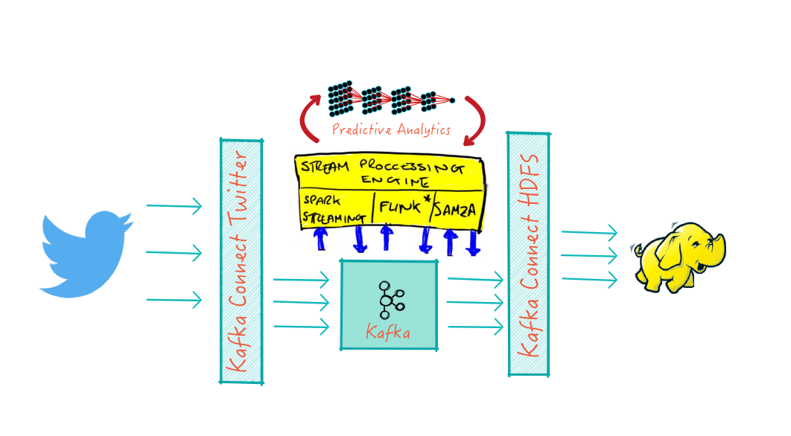

ML Experiments
==============
Sumo machine learning playground

###  Experiments
1. **NLP demo** with `lingPipe`, `Kafka Connect` and `Kafka Streams`
2. **Character Recognition** with Neural Networks `synaptic` on Node.Js
3. **Constraint Programming**  with `OptaPlanner`

####  Streaming ML Pipeline

