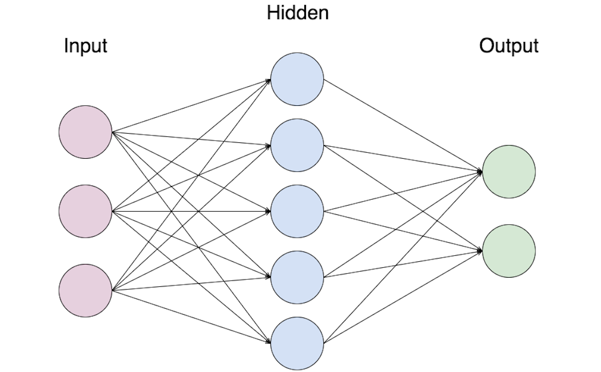
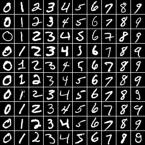

Neural Networks Demos
=====================

### Examples
1. Classification
2. XOR
3. Sum Perceptron

### Libraries
1. Synaptic
2. Brain.js

#### Neural networks


#### MNIST numbers


###  Prerequisite
1. NodeJs v6.1.0

###  Setup
```bash
npm install
```

###  Run
```bash
npm start
npm run start1
```

Reference
 - http://blog.webkid.io/neural-networks-in-javascript/
 - http://synaptic.juancazala.Perceptroncom/#/
 - https://github.com/cazala/mnist
