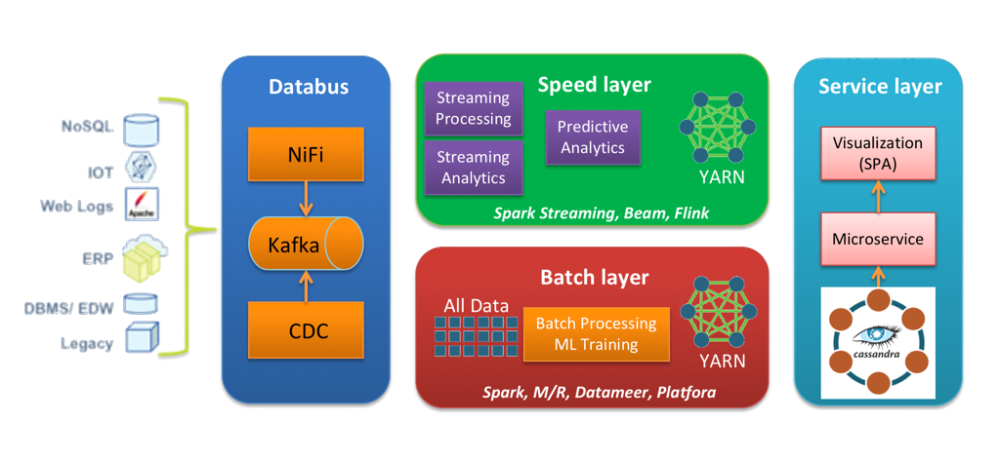
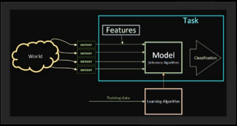

theme: Plain Jane

## Streaming Machine Learning

### Resilient Predictive Data Pipelines

---

# Agenda

1. Streaming Machine Learning Pipeline
    1. NLP with lingPipe, Kafka Connect and Kafka Streams
    2. Language Identification of Tweets
    3. Sentiment Analysis of Tweets
2. Neural Networks
    1. Handwriting Recognition
    2. Neural Networks with Synaptic on Node.Js
3. Constraint Programming (OR/CP)
    1. Cloud Balancing with OptaPlanner

---

# Why Do We Care About Resilience?
* Bugs happen!
    * Bugs in Predictive Data Pipelines have a large blast radius
    * The bugs can affect customers and a company’s profits & reputation!

---

# Desirable Qualities of a Resilient Data Pipeline
* Scalable
* Available
* Instrumented, Monitored, & Alert-enabled
* Quickly Recoverable


---

# Resilient Predictive Data Pipelines


---

# LingPipe - key features
- Sentiment Analysis
- Named Entity Recognition
- Clustering
- Topic Classification
- Language Identification

---

# Classification Data Pipeline


---

# Lambda Architecture



---

# What is Deep Learning?

> Neural networks, a biologically-inspired programming paradigm which enables a computer to learn from observational data.
Deep learning refers to artificial neural networks that are composed of many layers.



### Key Components
- Task
- Features
- Model
- Learning Algorithm

---
# Neural Networks with Synaptic

```javascript
import { Layer, Network, Trainer } from 'synaptic';

export default class Perceptron extends Network
{
    constructor(input, hidden, output) {
        super();
        this.inputLayer = new Layer(input);
        this.hiddenLayer = new Layer(hidden);
        this.outputLayer = new Layer(output);
    }
    connectLayers() {
        this.inputLayer.project(this.hiddenLayer);
        this.hiddenLayer.project(this.outputLayer);

        this.set({
            input: this.inputLayer,
            hidden: [this.hiddenLayer],
            output: this.outputLayer
        });
    }
}
```

---

# Neural Networks with Synaptic

```typescript
import mnist from 'mnist';
import { Layer, Network, Trainer } from 'synaptic';
import Perceptron from './utils/perceptron';

const set = mnist.set(700, 20);
const trainingSet = set.training;
const testSet = set.test;

let myPerceptron = new Perceptron(784,100,10);
myPerceptron.connectLayers();

const trainer = new Trainer(myPerceptron);
trainer.train(trainingSet, {
    rate: .2,
    iterations: 20,
    error: .1,
    shuffle: true,
    log: 1,
    cost: Trainer.cost.CROSS_ENTROPY
});

console.log(myPerceptron.activate(testSet[0].input));
console.log(testSet[0].output);
console.log("done");
```
---
